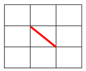
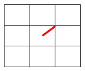

# **cross-stitch**

This repository defines a json schema to represent cross stitch patterns and provides tools to work with them.

## Usage

To run this project, run the `build` script followed by the `start` script.
Using yarn:

```
yarn build
yarn start
```

Alternatively, run the `dev` to enable live loading (via tsc-watch)

```
yarn dev
```

<hr/>
<br/>

## **JSON Schemas**

### **Cross Stitch Pattern Schema:**

See a full example [below](#full-schema-example)
```json
{
    "properties": {
        "colors": [],
        "stitchWidth": 30,
        "stitchHeight": 30,
        "notes": ""
    },
    "fullStitches": [],
    "threeQuarterStitches": [],
    "halfStitches": [],
    "quarterStitches": [],
    "backStitches": [],
    "longStitches": []
}
```

* `properties` - holds top level information about the cross stitch pattern, such as color and dimension information.

    * `colors` - an array of [`color`](#color-schema) objects defining all colors used in the pattern.

    * `stitchWidth` - a non negative integer representing the width, counted in stitches, of the pattern. This is not required.

    * `stitchHeight` - a non negative integer representing the height, counted in stitches, of the pattern. This is not required.

    * `notes` - an optional string for any notes/comment about the pattern.

* `fullStitches` - an array of [`full stitch`](#full-stitch-schema) objects defining all the full stitches in the pattern.

* `threeQuarterStitches` - an array of [`three quarter stitch`](#three-quarter-stitch-schema) objects defining all the three quarter stitches in the pattern.

* `halfStitches` - an array of [`half stitch`](#half-stitch-schema) objects defining all the half stitches in the pattern.

* `quarterStitches` - an array of [`quarter stitch`](#quarter-stitch-schema) objects defining all the quarter stitches in the pattern.

* `backStitches` - an array of [`back stitch`](#back-stitch-schema) objects defining all the back stitches in the pattern.

* `longStitches` - an array of [`long stitch`](#long-stitch-schema) objects defining all the long stitches in the pattern.

<hr/>
<br/>

### **Color Schema:**

```json
{
    "colorId": 1,
    "strands": [],
    "colorName": "Burnt Orange",
    "patternSymbol": "@",
    "totalFullStitches": 75,
    "totalThreeQuarterStitches": 0,
    "totalHalfStitches": 0,
    "totalQuarterStitches": 0,
    "totalBackStitches": 0,
    "totalLongStitches": 0
}
```

* `colorId` - a non negative integer identifier. Each color within the pattern must have a unique `colorId`

* `strands` - an array of [`strand`](#strand-schema) objects defining all the strands of thread that make up the color

* `colorName` - a name for the overall color (since it could be a blend)

* `patternSymbol` - the ASCII character used to represent the color on the pattern visually. This must be unique within all the `color` objects in the `colors` array

* `totalFullStitches` - the count of full stitches that use this color in the pattern. This is not required.
* `totalThreeQuarterStitches` - the count of three quarter stitches that use this color in the pattern. This is not required.

* `totalHalfStitches` - the count of half stitches that use this color in the pattern. This is not required.

* `totalQuarterStitches` - the count of quarter stitches that use this color in the pattern. This is not required.

* `totalBackStitches` - the count of back stitches that use this color in the pattern. This is not required.

* `totalLongStitches` - the count of long stitches that use this color in the pattern. This is not required.

<hr/>
<br/>

### **Strand Schema:**

Each [`color`](#color-schema) is made up of at least one `strand` object. Each `strand` is at least a single DMC thread strand, but can be increased using `strandCount`.

```json
{
    "colorName": "Orange Spice",
    "dmcThreadCode": "721",
    "strandCount": 2
}
```

* `colorName` - by convention this is the DMC name of the thread color. This is not required.

* `dmcThreadCode` - the DMC color code. This is typically numeric string like `'721'` or `3746` but there are a few alpha color codes like `'blanc'` and `'ecru'`.

* `strandCount` - an integer greater than one representing the number of strands of this definition to be used in the parent `color`. 

<hr/>
<br/>

### **Full Stitch Schema:**

A full stitch covers an entire square on the grid in an 'X' shape. It is the combination of 2 opposing angle half stitches.

```json
{
    "colorId": 1,
    "x": 10,
    "y": 20
}
```

* `colorId` - the id of the desired [`color`](#color-schema) of the stitch

* `x` - the x coordinate of the lower left side of the square on the grid.

* `y` - the y coordinate of the lower left corner of square on the grid.

**Example:**


```json
{
    "colorId": 1,
    "x": 1,
    "y": 1
}
```

<hr/>
<br/>

### **Three Quarter Stitch Schema:**

A three quarter stitch is simply a [quarter stitch](#quarter-stitch-schema) and a [half stitch](#half-stitch-schema) combined. Therefore, the half stitch angle and the quarter stitch placement must be given. For a 45 degree angle half stitch `top-right` and `bottom-left` are valid `quarterStitchPlacement` values. Conversely, for a 135 degree angle half stitch `top-left` and `bottom-right` are valid `quarterStitchPlacement` values.

```json
{
    "colorId": 1,
    "x": 10,
    "y": 20,
    "halfStitchAngle": 45,
    "quarterStitchPlacement": "top-right"
}
```

* `colorId` - the id of the desired [`color`](#color-schema) of the stitch

* `x` - the x coordinate of the lower left side of the square on the grid.

* `y` - the y coordinate of the lower left corner of square on the grid.

* `halfStitchAngle` - the angle of the half stitch which can be either `45` or `135`. See the [`half stitch`](#half-stitch-schema) schema for more information.

* `quarterStitchPlacement` - one of 4 values: `top-right`, `top-left`, `bottom-right`, `bottom-left` indicating the placement of the quarter stitch. See the [`quarter stitch`](#quarter-stitch-schema) schema for more information.

**Examples:**
    
**3/4 Stitch Top Right**


```json
{
    "colorId": 1,
    "x": 1,
    "y": 1,
    "halfStitchAngle": 45,
    "quarterStitchPlacement": "top-right"
}
``` 

<hr/>
<br/>

**3/4 Stitch Bottom Left**


```json
{
    "colorId": 1,
    "x": 1,
    "y": 1,
    "halfStitchAngle": 45,
    "quarterStitchPlacement": "bottom-left"
}
```

<hr/>
<br/>

**3/4 Stitch Top Left**


```json
{
    "colorId": 1,
    "x": 1,
    "y": 1,
    "halfStitchAngle": 135,
    "quarterStitchPlacement": "top-left"
}
```

<hr/>
<br/>

**3/4 Stitch Bottom Right**


```json
{
    "colorId": 1,
    "x": 1,
    "y": 1,
    "halfStitchAngle": 135,
    "quarterStitchPlacement": "bottom-right"
}
```

<hr/>
<br/>

### **Half Stitch Schema:**

Half stitches comes in two forms, one going between the top left and bottom right forming a 45 degree line. The other goes between the top right and bottom left forming a 135 degree line. Thus `45` and `135` are the only valid values for `stitchAngle`.

```json
{
    "colorId": 1,
    "x": 10,
    "y": 20,
    "stitchAngle": 45
}
```

* `colorId` - the id of the desired [`color`](#color-schema) of the stitch

* `x` - the x coordinate of the lower left side of the square on the grid.

* `y` - the y coordinate of the lower left corner of square on the grid.

* `stitchAngle` - the angle of the half stitch which can be either `45` or `135`.

**Examples:**

**1/2 Stitch 45 Degree**



```json
{
    "colorId": 1,
    "x": 1,
    "y": 1,
    "stitchAngle": 45
}
```

<hr/>
<br/>

**1/2 Stitch 135 Degree**


```json
{
    "colorId": 1,
    "x": 1,
    "y": 1,
    "stitchAngle": 135
}
```

<hr/>
<br/>

### **Quarter Stitch Schema:**

A quarter stitch can be located in either the `top-right`, `bottom-right`, `bottom-left`, or `top-left` as indicated by the `placement` field.

```json
{
    "colorId": 1,
    "x": 10,
    "y": 20,
    "placement": "top-right"
}
```

* `colorId` - the id of the desired [`color`](#color-schema) of the stitch

* `x` - the x coordinate of the lower left corner of the square on the grid

* `y` - the y coordinate of the lower left corner of the square on the grid

* `placement` - the placement of the quarter stitch within the square on the grid

**Examples:**

**1/4 Stitch Top Right**



```json
{
    "colorId": 1,
    "x": 1,
    "y": 1,
    "placement": "top-right"
}
```

<hr/>
<br/>

**1/4 Stitch Bottom Right**


```json
{
    "colorId": 1,
    "x": 1,
    "y": 1,
    "placement": "bottom-right"
}
```

<hr/>
<br/>

**1/4 Stitch Bottom Left**


```json
{
    "colorId": 1,
    "x": 1,
    "y": 1,
    "placement": "bottom-left"
}
```

<hr/>
<br/>

**1/4 Stitch Top Left**


```json
{
    "colorId": 1,
    "x": 1,
    "y": 1,
    "placement": "top-left"
}
```

<hr/>
<br/>

### **Back Stitch Schema:**

Back stitches can go laterally, vertically, or diagonally. A back stitch typically moves a full space in any of the possible directions, but 1/2 space fractional amounts are supported for any of the 4 coordinate values. A single back stitch can move across at most 1 grid space in any supported direction. For example if a single back stitch segment spans 1.5 spaces, it must be defined as 2 back stitches, one moving a full space, and one moving a half space.

```json
{
    "colorId": 1,
    "x1": 0,
    "y1": 0,
    "x2": 1,
    "y2": 0
}
```

* `colorId` - the id of the desired [`color`](#color-schema) of the stitch

* `x1` - the x coordinate of the start of the stitch

* `y1` - the y coordinate of the start of the stitch

* `x2` - the x coordinate of the end of the stitch

* `y2` - the y coordinate of the end of the stitch

**Examples:**

**Back Stitch Lateral**


Red:

```json
    {
    "colorId": 1,
    "x1": 1,
    "y1": 1,
    "x2": 2,
    "y2": 1
}
```

Green:

```json
{
    "colorId": 1,
    "x1": 1,
    "y1": 2,
    "x2": 1.5,
    "y2": 2
}
```

<hr/>
<br/>

**Back Stitch Vertical**


Red:

```json
{
    "colorId": 1,
    "x1": 2,
    "y1": 1,
    "x2": 2,
    "y2": 2
}
```

Green:

```json
{
    "colorId": 1,
    "x1": 1,
    "y1": 1,
    "x2": 1,
    "y2": 1.5
}
```

<hr/>
<br/>

**Back Stitch Diagonal**


Red:

```json
{
    "colorId": 1,
    "x1": 1,
    "y1": 2,
    "x2": 2,
    "y2": 1
}
```

Green:

```json
{
    "colorId": 1,
    "x1": 0,
    "y1": 1,
    "x2": 0.5,
    "y2": 1.5
}
```

<hr/>
<br/>

### **Long Stitch Schema:**

```json
{
    "colorId": 1,
    "x1": 0,
    "y1": 0,
    "x2": 5,
    "y2": 2
}
```
Long stitches are stitches that span more than 1 space. They can move laterally, vertically, or diagonally (just like back stitches). Long stitch coordinates also support 1/2 space fractional values.

**Examples:**


Red:

```json
{
    "colorId": 1,
    "x1": 0,
    "y1": 3,
    "x2": 2.5,
    "y2": 0
}
```

Green:

```json
{
    "colorId": 1,
    "x1": 0,
    "y1": 3,
    "x2": 3,
    "y2": 3
}
```

<hr/>
<br/>

### **Full Schema Example:**

An example of each stitch being used can be seen in the below image:


Here is the corresponding JSON that describes the stitches in the above image:

```json
{
    "properties": {
        "colors": [
            {
                "colorId": 0,
                "strands": [
                    {
                        "colorName": "Dark Blue",
                        "dmcThreadCode": "825",
                        "strandCount": 2
                    }
                ],
                "colorName": "Dark Blue",
                "patternSymbol": "@",
                "totalFullStitches": 1,
                "totalThreeQuarterStitches": 1,
                "totalHalfStitches": 0,
                "totalQuarterStitches": 0,
                "totalBackStitches": 0,
                "totalLongStitches": 0
            },
            {
                "colorId": 1,
                "strands": [
                    {
                        "colorName": "Orange Spice",
                        "dmcThreadCode": "721",
                        "strandCount": 1
                    },
                    {
                        "colorName": "Burnt Orange",
                        "dmcThreadCode": "947",
                        "strandCount": 1
                    }
                ],
                "colorName": "Orange Blend",
                "patternSymbol": "&",
                "totalFullStitches": 0,
                "totalThreeQuarterStitches": 0,
                "totalHalfStitches": 1,
                "totalQuarterStitches": 1,
                "totalBackStitches": 1,
                "totalLongStitches": 1
            }
        ],
        "stitchWidth": 3,
        "stitchHeight": 3,
        "notes": "This is a tiny 3x3 contrived example 'pattern'. Enjoy!"
    },
    "fullStitches": [
        {
            "colorId": 0,
            "x": 0,
            "y": 1
        }
    ],
    "threeQuarterStitches": [
        {
            "colorId": 0,
            "x": 2,
            "y": 1,
            "halfStitchAngle": 45,
            "quarterStitchPlacement": "top-right"
        }
    ],
    "halfStitches": [
        {
            "colorId": 1,
            "x": 1,
            "y": 1,
            "stitchAngle": 135
        }
    ],
    "quarterStitches": [
        {
            "colorId": 1,
            "x": 2,
            "y": 0,
            "placement": "bottom-right"
        }
    ],
    "backStitches": 
    [
        {
            "colorId": 1,
            "x1": 0,
            "y1": 0,
            "x2": 1,
            "y2": 0
        }
    ],
    "longStitches": [
        {    
            "colorId": 1,
            "x1": 0,
            "y1": 3,
            "x2": 3,
            "y2": 2
        }
    ]
}
```

## Versions
View all versions of in the <a href="/CHANGELOG.md">CHANGELOG.md</a>

## License
This project is licensed under the MIT License - see the <a href="/LICENSE.md">LICENSE.md</a> file for details